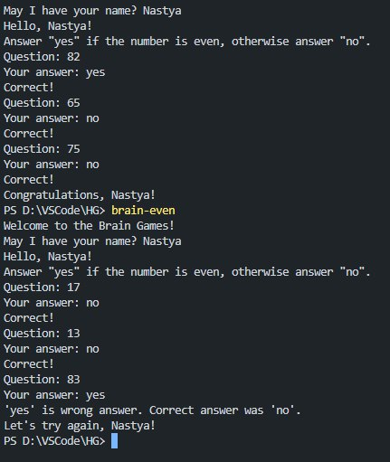
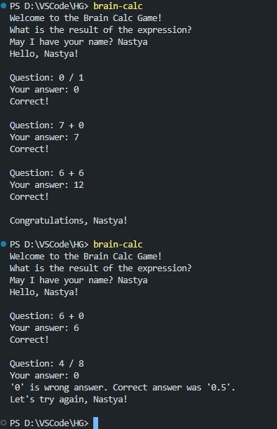
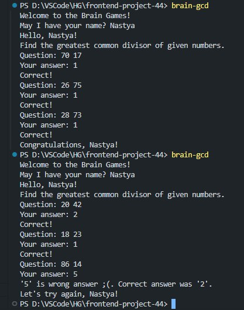
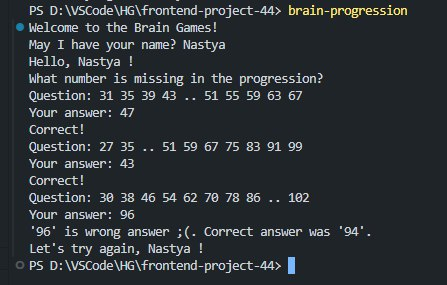
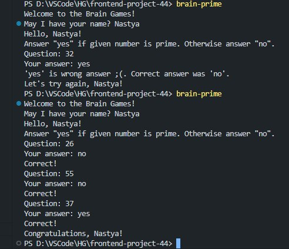

### Hexlet tests and linter status:
[](https://github.com/Blohhs/frontend-project-44/actions)

# Игра: "Проверка на чётность"
### Запуск при помощи команды ```brain-even```


# Игра: "Калькулятор"
### Запуск при помощи команды ```brain-calc```


# Игра "НОД"
### Запуск при помощи команды ```brain-gcd```


# Игра "Арифметическая прогрессия"
### Запуск при помощи команды ```brain-progression```


# Игра "Простое ли число?"
### Запуск при помощи команды ```brain-prime```
